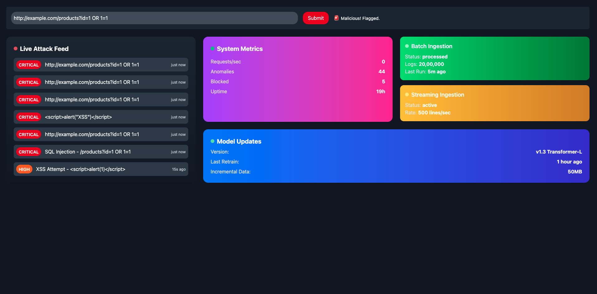

# 🚀 Transformer-based Web Application Firewall (WAF) – Demo Project

[🌐 Live Demo (Frontend)](https://demo-wfa.vercel.app/)

---

## 📌 Project Overview

Traditional Web Application Firewalls (WAFs) are mostly **rule-based** (signatures, regex).  
They fail to detect **zero-day exploits** and **never-seen-before attack payloads**.

This project demonstrates a **hybrid Transformer-based WAF** that combines:

- **Regex detection** for known payload patterns (SQLi, XSS, LFI).
- **Transformer-based classifier (BERT-Tiny)** for anomaly detection on URLs.
- **Whitelist/Blacklist logic** for fast allow/block decisions.

👉 This is a **demo version** built for hackathon purposes.

---

## 🎯 Problem Statement

- Rule-based WAFs **cannot handle new attack vectors**.
- Lack of **adaptive learning** from real traffic.
- Poor visibility into request anomalies.
- Limited scalability for modern web apps.

---

## ✅ Solution Overview

- **Hybrid Detection** → Regex + Transformer + Whitelist/Blacklist.
- **Transformer Model** (BERT-tiny, HuggingFace) fine-tuned on malicious/benign URLs.
- **FastAPI Backend** → exposes `/alerts` and `/test-batch` for detection.
- **React + Tailwind Dashboard** → monitor flagged requests, metrics, and ingestion status.
- **Metrics Tracking** → Accuracy, Precision, Recall, F1, ROC-AUC, PR-AUC, and Confusion Matrix.

---

## 🛠️ Tech Stack

**Frontend**

- React (Vite)
- TailwindCSS
- Axios
- Lucide Icons
- Recharts

**Backend**

- FastAPI
- PyTorch + HuggingFace Transformers
- Regex hybrid detection
- CORS Middleware

**Training**

- Dataset: Kaggle `urldata.csv` (benign vs malicious URLs)
- Domain-aware split (to avoid leakage across train/test).
- Weighted loss to handle class imbalance.

- Apache/Nginx log ingestion (Filebeat/Fluentd)
- Transformer model (PyTorch/HuggingFace)
- MongoDB / PostgreSQL for log storage
- Prometheus + Grafana for monitoring
- Docker & Kubernetes for deployment

---

## 📽️ Demo Walkthrough

- **Test Page:** Run single or batch URL tests, see probability + source (regex/ml/whitelist/blacklist).
- **Alerts Feed:** Incoming flagged URLs displayed in real time.
- **Metrics Dashboard:** Transformer accuracy, precision, recall, F1, ROC-AUC, PR-AUC, confusion matrix.
- **Ingestion Status:** Shows simulated streaming and batch log processing rates.
- **Model Info:** Version, last retrain, threshold, and ingested request count.

👉 Demo Video: [GitHub Issue](https://github.com/itzzfalcon52/demo-WFA/issues/1)  
👉 Screenshots: 

---

## Demo vs Final Product (Transformer-based WAF)

| Category    | Current Demo                                  | Final Product (Planned)                                        |
| ----------- | --------------------------------------------- | -------------------------------------------------------------- |
| Data Source | Kaggle URLs dataset + whitelist/blacklist     | Real Apache/Nginx access logs + live traffic ingestion         |
| Detection   | Regex + Transformer (BERT-tiny)               | Full Transformer anomaly detection (requests, headers, params) |
| Ingestion   | Mock batch + streaming logs                   | Real-time pipelines (Filebeat/Fluentd → Kafka → DB)            |
| Parsing     | URL normalization                             | Full HTTP parsing (headers, body, query, cookies)              |
| Model       | Transformer (BERT-tiny, ~15MB)                | Larger Transformer + continual fine-tuning on real logs        |
| Training    | One-time (Kaggle dataset)                     | Incremental training on production traffic                     |
| Inference   | FastAPI endpoint                              | Integrated WAF module in Apache/Nginx                          |
| Thresholds  | Static (0.5) + regex boost                    | Dynamic anomaly scores + policy engine                         |
| Alerts      | JSON alerts + frontend view                   | SOC dashboard + alert severity levels                          |
| Metrics     | Accuracy, Precision, Recall, ROC-AUC, ConfMat | Detailed (latency, anomaly distribution, top attack vectors)   |
| Security    | Demo-only                                     | Production-grade (auth, rate-limits, scaling, failover)        |
| Demo        | Test URLs via frontend                        | Live attack simulation + traffic injection                     |

---

## 📊 Current Metrics

⚠️ Disclaimer:  
Metrics are **unrealistically high** because the Kaggle dataset has trivially separable malicious vs benign URLs (e.g., domains and obvious keywords).  
For the **final product**, we will retrain on **real logs, adversarial payloads, and OWASP attack datasets**.

Example metrics from current demo training:

| Metric    | Score        |
| --------- | ------------ |
| Accuracy  | 99.75%       |
| Precision | 99.69%       |
| Recall    | 99.26%       |
| F1 Score  | 99.47%       |
| ROC-AUC   | 99.95%       |
| PR-AUC    | 99.91%       |
| TN / FP   | 71,697 / 69  |
| FN / TP   | 165 / 22,358 |

---

## ▶️ How to Run (Demo Project)

### 1. Backend (FastAPI + Transformer)

```bash
cd backend
python -m venv .venv
source .venv/bin/activate   # Mac/Linux
.venv\Scripts\activate      # Windows
pip install -r requirements.txt
uvicorn app:app --reload --port 8001
```

### 2. Frontend (React + Vite)

```bash
cd frontend
npm install
npm run dev
```

Access at: [http://localhost:5173](http://localhost:5173)

---

## 🚀 Next Steps for Hackathon

To move from demo → production-grade WAF, we plan to add:

## 📡 Real Log Ingestion:

-Capture live Apache/Nginx logs using Filebeat/Fluentd.

-Stream via Kafka → database for scalable processing.

## 🤖 Stronger Transformer Models:

-Replace bert-tiny with domain-specific pre-trained models.

-Fine-tune continuously on real web traffic.

-Explore transformer-based anomaly detection (not just classification).

## 📊 Advanced Frontend Dashboards:

-Interactive graphs for anomaly distribution & request patterns.

-Time-series charts (requests/sec, flagged vs safe).

-Filter/sort/search on flagged attack feed.

## ⚡ Real-Time Attack Simulation:

-Live payload injection via cURL/BurpSuite in demo.

-Show how the WAF flags previously unseen payloads.

## 🔒 Production-Grade Security:

-API authentication, rate limiting, and role-based dashboards.

-Failover handling + auto-scaling with Docker/Kubernetes.

## 📈 Monitoring & Analytics:

-Integrate Prometheus + Grafana for request/alert monitoring.

-Alerting pipeline for SOC (Slack/Email/Webhooks).

---

## 🤝 Contributors

- built with ❤️ bt team HELIOS

---

⚡ _This repo is for demo purposes. The hackathon version will expand with ML, real-time pipelines, and production-ready features._
